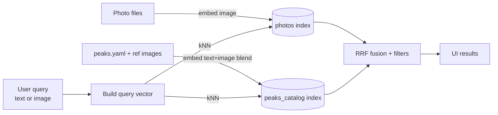

# multimodal-mountain-peak-search

> **Mountain peak identification & image search** with **SigLIP** embeddings on **Elasticsearch** (vector DB).  
> Text ↔ image queries, kNN, RRF, EXIF geo, and a Streamlit demo.

[](https://colab.research.google.com/github/<your-user-or-org>/multimodal-mountain-peak-search/blob/main/notebooks/02_quickstart_colab.ipynb)

---

## TL;DR — 5 commands

```bash
# 1) Install
pip install -r requirements.txt  # or see "Install" below

# 2) Configure ES (env) — pick one auth path
export ES_URL="http://localhost:9200"
export ES_API_KEY_B64="<base64_id:api_key>"

# 3) Create indices (dense_vector + HNSW)
python scripts/create_indices.py

# 4) Index peaks (blended text+image prototypes) + your photos
python scripts/embed_and_index_photos.py --index-peaks --peaks-yaml data/peaks.yaml --peaks-images-root data/peaks
python scripts/embed_and_index_photos.py --index-photos --images data/images --topk-predicted 5

# 5) Run the UI
streamlit run scripts/app.py
```

---

## What this project does

This repo shows how to **identify mountain peaks** (e.g., *Ama Dablam, Everest*) in your own photo library and **search images** by *name* or by *example photo*. It uses a modern multimodal embedding model (**SigLIP-2**) so **text** and **images** live in the **same vector space**. We store vectors in **Elasticsearch** (`dense_vector` + HNSW) and fuse multiple signals (image kNN, text kNN, metadata) with **RRF** to get stable, relevant results.

**Two core demos**
- **Search by name:** “Show me photos of *Ama Dablam*.” → text→image kNN over your library
- **Identify from photo:** Upload any photo → top peak guesses + similar library photos

Why it works well for peaks: small/far objects, tricky lighting, tons of look-alikes. We tackle this with **prompt ensembles**, **blended prototypes** (text + 1–3 reference images per peak), **geo-fencing**, and **RRF**.

---

## Features

- 🔎 **Text & image queries** — SigLIP-2 embeddings for both
- 🧠 **Blended peak prototypes** — text prompts + reference images per peak
- 🧭 **EXIF GPS & time** — optional geo-fence and timeline filters
- ⚡ **Fast kNN** — Elasticsearch HNSW with cosine similarity
- 🪄 **RRF fusion** — combine multiple weak signals into reliable results
- 🖥️ **Streamlit UI** — thumbnails + full-size modal preview
- 🧪 **Jupyter & Colab notebooks** — quickstart and reproducible examples

---

## Repo layout

```
multimodal-mountain-peak-search/
├── scripts/
│   ├── create_indices.py           # ES indices (peaks_catalog, photos)
│   ├── embed_and_index_photos.py   # index peaks (blended) + photos (vectors, EXIF, predicted_peaks)
│   ├── query_by_peak.py            # CLI: search photos by peak name (text→image kNN)
│   └── identify_and_similar.py     # CLI: identify + similar photos with confidence
├── src/
│   └── ai_mpi/embeddings.py        # SigLIP-2 wrapper (image_vec/text_vec, L2-normalized)
├── data/
│   ├── peaks.yaml                  # peak catalog (id, names, lat/lon, elevation)
│   ├── training_peaks/<peak_id>/*           # 1–3 reference photos per peak (optional, improves accuracy)
│   └── images/**/*                 # photo library (put your own images here)
└── notebooks/
    ├── 01_quickstart_local_jupyter.ipynb
    └── 02_quickstart_colab.ipynb
```

---

## Install

```bash
# in a fresh venv
pip install streamlit pillow pillow-heif elasticsearch torch torchvision transformers pyyaml
# If you have CUDA, install the matching torch wheel for your setup
```

(Or use `requirements.txt` if included.)

**HEIC support:** `pip install pillow-heif`

---

## Configure Elasticsearch

Set one of:

```bash
# Self-hosted (default)
export ES_URL="http://localhost:9200"

# Auth (choose one)
export ES_API_KEY_B64="<base64_id:api_key>"         # easiest
# or:
export ES_API_KEY_ID="<id>"; export ES_API_KEY="<key>"

# Elastic Cloud (optional)
export ES_CLOUD_ID="<your_cloud_id>"                # + one of the API key options above
```

Optional:
```bash
# for local thumbnails in the UI
export BASE_IMAGE_DIR="data/images"
# switch models at runtime (default defined in embeddings.py)
export SIGLIP_MODEL_ID="google/siglip-so400m-patch14-384"
```

---

## Quickstart (local)

1) **Create indices**
```bash
python scripts/create_indices.py
# If changing vector dims or fields:
# python scripts/create_indices.py --recreate
```

2) **Seed the peak catalog**

Add entries to `data/peaks.yaml` like:
```yaml
- id: ama-dablam
  names: ["Ama Dablam"]
  latlon: {lat: 27.86167, lon: 86.86139}
  elev_m: 6812

- id: mount-everest
  names: ["Mount Everest", "Sagarmatha", "Chomolungma", "Qomolangma"]
  latlon: {lat: 27.98833, lon: 86.92528}
  elev_m: 8849
```

(Optional but recommended) place **1–3 reference images** per peak under `data/peaks/<id>/`.

Index peaks with **blended** vectors:
```bash
python scripts/embed_and_index_photos.py \
  --index-peaks \
  --peaks-yaml data/peaks.yaml \
  --peaks-images-root data/peaks \
  --blend-alpha-text 0.55 \
  --blend-max-images 3
```

3) **Index your photos**
```bash
python scripts/embed_and_index_photos.py \
  --index-photos \
  --images data/images \
  --photos-index photos \
  --peaks-index peaks_catalog \
  --topk-predicted 5
```

4) **Run the UI**
```bash
streamlit run scripts/app.py
```

---

## Notebooks

- **Local Jupyter**: `notebooks/01_quickstart_local_jupyter.ipynb`  
- **Google Colab**: `notebooks/02_quickstart_colab.ipynb` (with Colab badge at top)

---

## How it works

**Text & image live in the same vector space.**  
We encode:
- **Photos → image vectors** → store in `photos.clip_image`
- **Peak names (+ optional reference images) → blended text vectors** → store in `peaks_catalog.text_embed`

At query time:
- **Search by name**: build a robust **text** vector and run kNN over `photos.clip_image`.
- **Identify from photo**: use the photo’s **image** vector to retrieve top peaks from `peaks_catalog`, then retrieve **similar photos** using either:
  - the **text** vector of the best peak (stable), or
  - the **image** vector of the uploaded photo (literal similarity).

We optionally **geo-fence** (EXIF GPS) and **fuse** multiple signals using **RRF** for better ranking.



---

## Index schemas

**`peaks_catalog`**
- `id` *(keyword)*
- `names` *(keyword[])* — primary name + aliases
- `latlon` *(geo_point)*
- `text_embed` *(dense_vector)* — L2-normed, cosine, HNSW

**`photos`**
- `path` *(keyword)*
- `clip_image` *(dense_vector)* — L2-normed, cosine, HNSW
- `predicted_peaks` *(keyword[])* — top-k names (from catalog)
- `gps` *(geo_point, optional)*
- `shot_time` *(date, optional)*

---

## CLI examples

**Search by name (with geo-fence):**
```bash
python scripts/query_by_peak.py --peak "Ama Dablam" --k 30 --num-candidates 4000 \
  --lat 27.93 --lon 86.90 --distance 120km
```

**Identify + similar (with confidence):**
```bash
python scripts/identify_and_similar.py --image data/images/IMG_0001.jpg --neighbors 30
# or use the image vector directly:
python scripts/identify_and_similar.py --image data/images/IMG_0001.jpg --use-image-query
```

---

## Quality knobs

- **Model**: `google/siglip-so400m-patch14-384` (best accuracy for small/far peaks).  
  Lightweight alternates: `siglip2-base-patch16-224` / `-256`.
- **Blended prototypes**: `--blend-alpha-text` (0.4–0.6 sweet spot), `--blend-max-images` (1–3).
- **kNN params**: start with `k=200`, `num_candidates=2000–4000`.
- **RRF**: unweighted RRF (widely available). Tune `rank_window_size=200`, `rank_constant=60`.
- **Geo-fence**: big win when GPS exists (use a realistic radius for EBC trek).


---

## Troubleshooting

- **`unknown setting [index.knn]`** → You’re on modern ES: use `dense_vector` + HNSW (this repo does). Recreate indices.
- **HEIC won’t load** → `pip install pillow-heif`
- **EXIF GPS errors** → Our parser guards odd formats; ensure you’re using this repo’s scripts.
- **RRF “weight” unknown** → Use **unweighted** RRF (supported broadly). The UI/requests here use that.

---

## Contributing

PRs welcome! Ideas:
- Plug another vector DB (FAISS/Qdrant/Weaviate)
- Add a simple linear probe re-ranker
- Export a small, licensed sample dataset

---

## License

MIT (or change to your preference).
